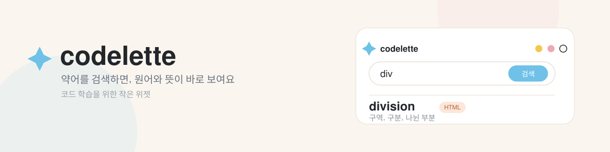

<p align="center">
  
</p>

<p align="center">
  
  
  
  
  
  
</p>

<p align="center">
  <b>약어 하나, 궁금증 하나, 클릭 한 번.</b><br>
  코드 속 약어를 원어와 한국어 뜻으로 바로 보여주는 작은 학습 위젯
</p>

<p align="center">
  <a href="#프로젝트-소개">프로젝트 소개</a> / <a href="#화면-미리보기">화면 미리보기</a> / <a href="#팀원과-역할-분담">팀 소개</a> / <a href="#협업-과정">협업 과정</a> / <a href="#실행-방법">실행 방법</a>
</p>

## 프로젝트 소개

**codelette**은 2인 팀이 만드는 학습 위젯 프로젝트입니다. 코드 속 짧은 약어(div, arr, func 등)를 검색하거나 드래그하면 원어 전체 단어와 한국어 뜻을 바로 보여줍니다. 코딩을 처음 배우는 학생, 영어권이 아닌 개발 학습자가 약어의 어원만 알아도 크게 줄어드는 학습 장벽을 해소하는 데 집중합니다.

구현 범위는 약어 검색과 뜻풀이를 보여주는 MVP이며, 사용자 계정이나 학습 기록 저장, 유료 기능은 이후 단계로 미룹니다.

| 구성 | 내용 |
| --- | --- |
| 참여 | 2인 팀 |
| 구현 | HTML5, CSS3, JavaScript로 만드는 검색 + 뜻풀이 위젯 (MVP) |
| 협업 | Git, GitHub, 작업 브랜치, Pull Request, GitHub Projects |
| 저장소 | [codelette-dev/codelette](https://github.com/codelette-dev/codelette) |

## 화면 미리보기

<table>
  <tr>
    <td width="50%" align="center">🚧<br><b>검색 화면</b><br>준비 중</td>
    <td width="50%" align="center">🚧<br><b>결과 화면</b><br>준비 중</td>
  </tr>
</table>

MVP 구현이 끝나는 대로 실제 스크린샷으로 이 섹션을 채울 예정입니다.

## 팀원과 역할 분담

<table>
  <tr>
    <td align="center"><a href="https://github.com/justinweon"><br><b>원정린</b></a><br>Data Management</td>
    <td align="center"><a href="https://github.com/mjlee0914"><br><b>mjlee0914</b></a><br>Frontend</td>
  </tr>
</table>

| 이름 | GitHub | 담당 | 주요 작업 | 코드 |
| --- | --- | --- | --- | --- |
| 원정린 | [justinweon](https://github.com/justinweon) | Data Management | 약어 사전 데이터 설계·수집, Supabase DB 구성, API 연동 | 준비 중 |
| mjlee0914 | [mjlee0914](https://github.com/mjlee0914) | Frontend | 위젯 UI 구현, 검색/결과 렌더링, 이벤트 처리 | 준비 중 |

전체 변경 과정은 [커밋 이력](https://github.com/codelette-dev/codelette/commits/main/)과 [Pull Request 목록](https://github.com/codelette-dev/codelette/pulls?q=is%3Apr)에서 확인할 수 있습니다.

### 기술 스택

| 구분 | 기술 | 역할 |
| --- | --- | --- |
| Frontend | HTML | 화면 구조 구성 |
| Frontend | CSS | 디자인, 레이아웃, 반응형 UI |
| Frontend | JavaScript (Vanilla JS) | 검색, 이벤트 처리, 결과 렌더링 |
| API 통신 | Fetch API | JavaScript에서 Supabase API 호출 |
| Backend Platform | Supabase | DB, API, 보안 등 백엔드 기능 담당 |
| Database | PostgreSQL | 용어 데이터 저장 |
| Data | CSV → Supabase | 초기 데모 용어 데이터 입력 |
| DB 관리 | Supabase Dashboard / DBeaver | 테이블 및 데이터 확인 |
| Version Control | Git + GitHub | 코드 버전 관리 |
| Project Management | GitHub Projects | Backlog, Task, 진행 상황 관리 |

## 협업 과정

역할별로 작업 브랜치를 나누어 개발했습니다. 브랜치는 `feature/이니셜/작업명` 형태로 구분하고, 변경 사항을 PR로 올려 `main`에 통합합니다.

```text
기능 구현 → 작업 브랜치에 커밋 → GitHub에 push → PR 생성 → main에 병합
```

진행 상황은 GitHub Projects의 Backlog와 Task 보드로 관리합니다.

## 실행 방법

1. 저장소를 내려받습니다.

   ```bash
   git clone https://github.com/codelette-dev/codelette.git
   cd codelette
   ```

2. 다운로드한 폴더를 브라우저 확장 프로그램으로 로드합니다. Chrome 기준 `chrome://extensions` → 개발자 모드 켜기 → "압축해제된 확장 프로그램 로드" → 내려받은 폴더 선택.
3. 위젯 아이콘을 눌러 검색창에 약어를 입력하면 결과가 표시됩니다.

별도의 빌드나 패키지 설치 없이 바로 실행할 수 있도록 만드는 것을 목표로 합니다.

### 데이터와 실행 환경

용어 데이터는 CSV로 초기 입력되어 Supabase(PostgreSQL)에 저장되고, 위젯은 Fetch API로 이 데이터를 조회합니다. 인터넷 연결이 없으면 검색 결과가 표시되지 않습니다.

## 폴더 구조

> 🚧 아직 코드 구현 전 단계라 아래 구조는 계획안이며, 실제 구현 시 달라질 수 있습니다.

```text
codelette/
├─ manifest.json           # 브라우저 확장 프로그램 설정
├─ popup/
│  ├─ index.html          # 검색창 + 결과 UI
│  ├─ style.css           # 위젯 스타일
│  └─ script.js           # 검색, Supabase 호출, 결과 렌더링
├─ data/
│  └─ terms.csv            # 초기 데모 용어 데이터
├─ docs/readme/             # 배너, 스크린샷 등 README용 리소스
└─ README.md
```

페이지별 구조는 구현이 시작되는 대로 실제 파일 구성에 맞춰 업데이트할 예정입니다.
